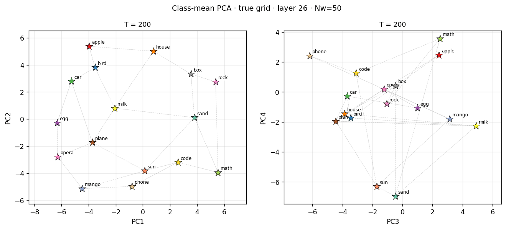

# In-Context Bayesians: Graph Structure Learning in LLMs



**Bayesian Deep Learning — Final Project**  
Katharine Kowalyshyn · Timothy Duggan · Daniel Little

---

## Overview

This repository investigates whether large language models perform **in-context Bayesian inference over graph structure**.  We expose Llama 3.1 8B to token sequences generated by random walks on two competing graphs — a 4×4 grid and a 16-node ring — and ask: does the model's next-token distribution converge toward an ideal Bayesian observer's posterior-predictive distribution as context grows?

Our contributions are:

1. **Ideal-observer construction.** An exact Bayesian graph observer that maintains a posterior over a discrete set of graph hypotheses and produces a posterior-predictive next-token distribution at each context length.
2. **Sigmoid belief-dynamics fits (baseline model).** We fit the Bigelow et al. (2025) sigmoid model `p̂(N) = p₀ + (q − p₀)·σ(b + γN^{1−α})` to LLM accuracy curves across a full ρ-ladder of grid/ring mixing ratios.
3. **Complexity-sensitive prior (upgrade model).** We extend the baseline with a learned prior `b_k = b₀ − λ·C(G_k)`, where `C(G)` is the edge-list MDL complexity of the graph, and show that `λ > 0` is recovered from data — i.e. the LLM assigns more prior mass to structurally simpler graphs.
4. **Representational analysis.** We extract residual-stream activations from layer 26 and show via PCA and Dirichlet energy that class-mean representations progressively align with the true underlying graph structure as context grows, reproducing the Park et al. (ICLR 2025) findings in a new controlled setting.
5. **Full ρ-ladder comparison.** We sweep mixing between grid and ring and compare the LLM to **global structure inference** (ideal Bayes), **local undirected edge learning**, **directed transition copying** (cache bigram), **global unigram** frequency (Dirichlet-smoothed type counts), and a **no-walk semantic prior** from the pretrained model. We report KL, MSE, and Pearson correlation per context length, and optionally fit a **mixture over those five predictors** to ask which explanation best tracks the LLM distribution as context grows.

---

## Repository Structure

```
incontext-bayesians/
├── docs/
│   └── readme_pca_evolution.gif       # PCA animation for the README (regenerate via scripts/make_pca_gif.py)
├── environment.yml                     # Conda environment (Python 3.11, PyTorch 2.4, TransformerLens 2.16)
├── scripts/
│   ├── make_pca_gif.py                # Build GIF from pca_*.npz snapshots
│   ├── regenerate_16node_data.sh      # End-to-end data + fit pipeline (nohup-safe)
│   └── run_pca_pipeline.sh            # PCA + Dirichlet-energy pipeline
│
└── src/
    ├── initial_experiments/               # Graph defs, accuracy collection, Park-style PCA (tables below)
    ├── experiments/                       # Sigmoid + upgrade fits on vocabulary_tl JSON
    └── secondary_experiments/             # Distribution baselines, mixtures, PCA, composite figures
```

**Module guide.** The two experiment trees serve different goals: `initial_experiments` focuses on **neighbor-hit accuracy** over open vocabulary tokens and a **Park et al.–style** representation pipeline; `secondary_experiments` compares **full softmax vectors** on a **closed 16-word** vocabulary to interpretable baselines. Extra CLI detail: `src/secondary_experiments/README.md`.

### `src/initial_experiments/` (every Python file)

| File | Role |
|------|------|
| `graphs.py` | Graph constructors, ring/grid word lists (16-node disjoint/overlap, legacy month lists), colour maps. |
| `sanity_check.py` | Shuffled 4×4 `Grid`, shared grid vocabulary, seeding, **interleaved** sequence helpers. |
| `bayesian_model.py` | Ideal observer: walk likelihood, log-odds, posterior predictive; **complexity priors** (`edge_complexity_bits`, legacy MST bits); plotting helpers. |
| `vocabulary_tl_experiment.py` | Main **Llama 3.1 8B** accuracy pipeline: full ρ-ladder, `disjoint` / `overlap` → `results/vocabulary_tl/*.json`. |
| `pca_analysis.py` | Park-style **PCA** (Nw=50, T ∈ {200,400,1400}), **Dirichlet energy**, **Laplacian spectral** embeddings + Procrustes overlay, `months_permuted` Fig. 3 reproduction; `--with-model` = full GPU path. |
| `mixing_experiment.py` | **Earlier exploratory** script: ρ ∈ {0, 0.5, 1}, segment mixing, **12-node month ring** → `results/mixing_experiment/` (superseded for paper figures by `vocabulary_tl_experiment.py`; kept for reproducibility). |

Artefacts: `results/vocabulary_tl/`, `results/mixing_experiment/`, `pipeline_summary_*.md`.

### `src/secondary_experiments/` (every Python module)

| File | Role |
|------|------|
| `graphs.py` | `UndirectedGraph` + builders: grid, ring, chain, star, uniform. |
| `vocabulary.py` | Fixed 16-word list; single-token validation against Llama. |
| `sequence_generation.py` | Pure walks; **per-transition mixed** walks with source label per position. |
| `bayesian_observer.py` | Posterior over candidate graphs; posterior-predictive next-token distribution. |
| `cache_baseline.py` | **Directed** local bigram cache from the current token (Laplace smoothing). |
| `edge_learner.py` | **Symmetric** undirected edge learner (Beta-style edge priors). |
| `unigram_dirichlet.py` | **Global unigram** Dirichlet–multinomial; same pseudocount `alpha` as the cache baseline. Emitted as `unigram_distribution` on every experiment row. |
| `llm_inference.py` | Float16 Llama loads; forwards; **`semantic_prior_table`** (no-walk baseline). |
| `experiment.py` | Rows: Bayes, cache, edge-learner distr.; LLM + KL/MSE/r vs each; semantic prior; `closest_baseline_kl`. |
| `metrics.py` | KL, MSE, Pearson correlation. |
| `plotting.py` | Figures from JSON (KL heatmaps, neighbor curves, posteriors, …). |
| `pca_analysis.py` | Residual-stream PCA + Dirichlet energy (secondary results layout). |
| `mixture_analysis.py` | Mixture over **five** predictors: ideal Bayes, edge learner, cache, unigram, semantic prior. |
| `config.py` | `ExperimentConfig` (graphs, eval lengths, edge-learner priors, float16). |
| `run_experiment.py` | One run / out-dir (`--mix`, `--skip-llm`, `--dtype`). |
| `run_all.py` | Batch subprocesses; **ρ-ladder**; many graphs. |
| `run_mixture.py` | Fit mixture from `llm_results.json` → `mixture_analysis.json` + plots. |
| `run_pca.py` | PCA for one folder; `--mix` for mixed conditions. |
| `run_pca_all.py` | Discover all `results/` subfolders; batch PCA. |
| `plot_pca_rho_grid.py` | Multi-ρ PCA grid at fixed T (standard + off-diagonal PCs; edge overlays). |
| `tests/` | Observer, edge learner, mixture tests. |

### `src/experiments/`

`data_loading.py`, `fit_baseline.py`, `fit_upgrade.py`, `generate_rho_ladder.py`; outputs under `src/experiments/results/` (12-node archive: `results/_archive_12node/`).

---

## Setup

### Requirements

- CUDA GPU with ≥16 GB VRAM (model loads in float16; 47 GB tested)
- Hugging Face access to `meta-llama/Llama-3.1-8B`

### Install

```bash
conda env create -f environment.yml
conda activate incontext-bayesians
```

Set your Hugging Face token if the model is gated:

```bash
huggingface-cli login
```

---

## Experimental Conditions

We use two conditions, each with a 16-node ring paired against the 4×4 grid:


| Condition  | Ring vocabulary                                                        | Shared tokens with grid |
| ---------- | ---------------------------------------------------------------------- | ----------------------- |
| `disjoint` | 16 semantically neutral nouns, fully disjoint from the grid vocabulary | none                    |
| `overlap`  | 16 neutral nouns; *rock*, *sand*, *box* also appear in the grid        | 3                       |


For each condition we sweep the ring fraction ρ ∈ {0, 0.2, 0.3, 0.4, 0.5, 0.6, 0.7, 0.8, 1.0} with 16 random-walk sequences per cell (one starting node per graph vertex).

---

## Running the Experiments

### 1. Collect LLM accuracy data + fit both Bayesian models

```bash
# Runs vocabulary_tl_experiment.py for both conditions,
# then fit_baseline.py (Tim) and fit_upgrade.py (Dan).
nohup bash scripts/regenerate_16node_data.sh \
    > logs/regen_$(date +%Y%m%d_%H%M%S).log 2>&1 & disown

tail -f logs/regen_*.log
```

Results are written to:

- `src/initial_experiments/results/vocabulary_tl/{disjoint,overlap}.json`
- `src/experiments/results/baseline_fits/`
- `src/experiments/results/upgrade_fits/`
- `src/experiments/results/figures/`

### 2. Full distribution-level comparison (secondary experiments)

```bash
# All mixing ratios (ρ = 0, 0.2, 0.3, 0.4, 0.5, 0.6, 0.7, 0.8, 1),
# all graph types (grid, ring, chain, uniform), 16 seeds each.
nohup python -m src.secondary_experiments.run_all --rho-ladder \
    > logs/secondary_$(date +%Y%m%d_%H%M%S).log 2>&1 & disown
```

Results are written to `src/secondary_experiments/results/`.

### 2b. Mixture-of-baselines (optional)

After a run whose `llm_results.json` rows include **`unigram_distribution`** (re-run `run_experiment` / `run_all` for that folder if you have an older file without this field):

```bash
python -m src.secondary_experiments.run_mixture \
  --input src/secondary_experiments/results/all_graphs/grid/llm_results.json \
  --out-dir src/secondary_experiments/results/all_graphs/grid
```

See `src/secondary_experiments/README.md` for output filenames.

### 3. PCA and Dirichlet-energy analysis

```bash
# Run PCA for every condition (discovers result folders automatically).
nohup python -m src.secondary_experiments.run_pca_all \
    > logs/pca_all_$(date +%Y%m%d_%H%M%S).log 2>&1 & disown
```

### 4. Summary figures across all ρ values

```bash
# 2-row × 9-column PCA grid (PC1/2 and PC3/4 at T=1400).
python -m src.secondary_experiments.plot_pca_rho_grid

# With ideal graph-edge overlays.
python -m src.secondary_experiments.plot_pca_rho_grid --with-structure

# 4-row split: grid edges (top) vs ring edges (bottom).
python -m src.secondary_experiments.plot_pca_rho_grid --split

# Off-diagonal PC pairs (1/3, 1/4, 2/3, 2/4) — all variants.
python -m src.secondary_experiments.plot_pca_rho_grid --off-diagonal --with-structure --split
```

---

## Key Results

### Bayesian Belief Dynamics

The baseline sigmoid model fits well across all ρ cells (train MSE < 0.01 for most conditions). The inflection point N* — the context length at which the LLM transitions from near-chance to near-ceiling accuracy — is:

- **Earlier for the grid** (more edges, richer context signal per token) than for the ring.
- **Monotonically later** as ρ increases (more ring tokens → more interference with grid learning).

### Complexity-Sensitive Prior

The Upgrade model recovers `λ > 0` stably across both conditions, confirming that the LLM implicitly assigns more prior mass to the structurally simpler graph (ring, 16 edges) over the denser grid (24 edges). The per-graph parameterisation consistently wins on AIC/BIC over the mixture-bias version.

Complexity measure used: `C(G) = |E(G)| · ⌈log₂ |V|⌉` bits (edge-list MDL; grid = 96 bits, ring = 64 bits).

### Representational Analysis

PCA of layer-26 residual-stream class means shows:

- At **short context** (T ≤ 200) representations are essentially random — no graph structure is visible.
- At **medium context** (T ≈ 400) partial structure emerges in PC1/PC2.
- At **long context** (T = 1400) class means align strongly with the true generating graph; Dirichlet energy under the correct adjacency is substantially lower than under any other graph hypothesis.
- In **mixed conditions** (0 < ρ < 1) both structures are visible simultaneously — grid edges emerge in PC1/PC2 while ring edges appear in PC3/PC4 — suggesting the model maintains separable representations for competing in-context structures.

### Distribution-Level Comparison

Across pure-graph conditions, the Bayesian observer typically attains the strongest **Pearson correlation** with the LLM's next-token distribution at long context (e.g. \(T \ge 400\)). The **semantic prior** is often competitive at very short context—reflecting pretrained word associations—before structure-sensitive baselines dominate. **`run_mixture.py`** quantifies how much of the LLM distribution is explained by blending global Bayes, symmetric edge learning, directed caching, unigram frequency, and the no-walk prior as \(T\) grows.

---

## Models and Baselines

| Model | Description |
| --- | --- |
| **Ideal Bayesian observer** | Discrete posterior over a small candidate graph set; posterior-predictive next-token distribution. |
| **Cache baseline** | Laplace-smoothed **directed** bigram: counts of “what followed this current word earlier in context.” |
| **Edge learner** | **Undirected** edge scores with symmetric updates and Beta-style edge priors; not restricted to a fixed graph catalogue. |
| **Semantic prior** | Llama next-token distribution given only the current word (no walk context); measures pretrained association vs induced structure. |
| **Mixture of baselines** | Post-hoc simplex mixture over Bayes, edge learner, cache, unigram, and semantic prior (see `run_mixture.py`). **Requires** `llm_results.json` produced after this change (each row includes `unigram_distribution`). |
| **Unigram Dirichlet** | Predicts from global unigram counts in context (same `alpha` as cache); always in secondary JSON rows and in the five-way mixture. |
| **Baseline sigmoid** | Bigelow et al. (2025) scalar curve \( \hat p(N) = p_0 + (q-p_0)\,\sigma(b + \gamma N^{1-\alpha}) \) fit to neighbor accuracy. |
| **Upgrade prior** | Sigmoid upgrade with complexity-weighted bias \( b_k = b_0 - \lambda\,C(G_k) \). |


---

## Tests

```bash
python -m pytest src/secondary_experiments/tests/ -v
```

Tests cover the Bayesian observer (posterior normalisation, flat-prior recovery), the edge learner, and the mixture-of-baselines analysis (now including unigram in synthetic rows).

---

## References

- Bigelow et al. (2025). *In-context learning as Bayesian inference over sequences.*
- Park et al. (2025). *The geometry of categorical and hierarchical concepts in large language models.* ICLR 2025.
- Elhage et al. (2021). *A mathematical framework for transformer circuits.* Anthropic.

---

## Citation

If you build on this work, please cite:

```bibtex
@misc{kowalyshyn2025incontext,
  title  = {In-Context Bayesians: Graph Structure Learning in Large Language Models},
  author = {Kowalyshyn, Katharine and Duggan, Timothy and Little, Daniel},
  year   = {2025},
  note   = {Bayesian Deep Learning Final Project}
}
```

